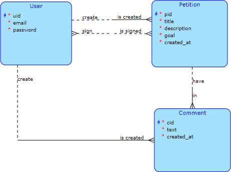

# Semestral project - Petition application

Petition Platform is a Spring Boot application designed to 
manage and facilitate online petitions.

This application allows users to create petitions and sign other users' petitions.
The user also has the opportunity to comment on petitions.

## RA Scheme



## Technologies Used

- **Java**
- **Spring Boot**
- **MySQL**

## Download and Install

1. Clone repository:

   ```bash
   git clone https://gitlab.fit.cvut.cz/zhurasem/petitions-sb-backend.git

## API Description

## Users

### Create User
- **POST** `/users`
   - Parameters:
      - String username;
      - String email;
      - String password;

### Read all Users
- **GET** `/users`

### Read User
- **GET** `/users/{id}`
   - PathVariable: String username;

### Update User
- **PUT** `/users/{id}`
   - PathVariable: String username;
   - Parameters:
      - String email;
      - String password;

### Delete User
- **DELETE** `/users/{id}`
   - PathVariable: String username;

## Petition

### Create Petition
- **POST** `/petitions`
   - Parameters:
      - Long pid;
      - String title;
      - String text;
      - int goal;
      - Date dateFrom;
      - String authorPetitionId;

### Read all Petitions
- **GET** `/petitions`

### Read Petition
- **GET** `/petitions/{id}`
   - PathVariable: Long pid;

### Update Petition
- **PUT** `/petitions/{id}`
   - PathVariable: Long pid;
   - Parameters:
      - String title;
      - String text;
      - int goal;
      - Date dateFrom;

### Delete Petition
- **DELETE** `/petitions/{id}`
   - PathVariable: Long pid;

## Comment

### Create Comment
- **POST** `/comments`
   - Parameters:
      - Long cid;
      - String text;
      - Date dateFrom;
      - String authorCommentId;
      - Long petitionCommentId;

### Read all Comments
- **GET** `/comments`

### Read Comment
- **GET** `/comments/{id}`
   - PathVariable: Long cid;

### Update Comment
- **PUT** `/comments/{id}`
   - PathVariable: Long cid;
   - Parameters:
      - String text;
      - Date dateFrom;

### Delete Comment
- **DELETE** `/comments/{id}`
   - PathVariable: Long cid;
